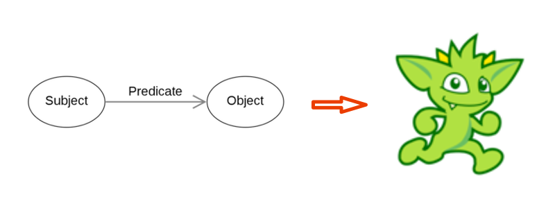

# azure-rdf2cosmos

A RDF to CosmosDB graph database migration process.

<p align="center"></p>

---

## The Conversion/Migration Process

There are four steps to the process, each implemented as the bash and powershell
scripts listed below.  The process is designed to support huge input files.

The first step converts the raw RDF (i.e. - *.rdf, *.ttl, etc.) files, exported from the
source database, into ***.nt** files.  These are known as **triples**, and this conversion
is done simply with an **Apache Jena** utility called **riot**.  Riot is an acronym for
**RDF I/O technology (RIOT)**.  Each triple consists of a subject, predicate, and object.

**Apache Jena** is expected to be installed on the workstation/VM where this process executes;
links and installation instructions below.

The second step accumulates and transforms the *.nt files into Java objects that are persisted
as JSON files.  The nt triples represent atomic data elements in an eventual Gremlin
Vertex or Edge, and the nt files aren't necessarily sorted.  Therefore the atomic nt rows
are **aggregated into JSON Vertex and Edge documents**.  The many Vertex and Edge JSON files are 
each persisted to disk in the current implementation, but they can alternatively be persisted
to a database (i.e. - CosmosDB/SQL or Azure PostgreSQL) to achieve scalability.

The third step transforms the JSON files into a format suitable for loading into CosmosDB/Gremlin.
The current implementation uses the **Groovy** format.  Alternatively, CSV can be implemented
in the future to enable the use of the 
[azure-cosmosdb-gremlin-bulkloader](https://github.com/cjoakim/azure-cosmosdb-gremlin-bulkloader).

The fourth and final step of the process loads CosmosDB with the file(s) created in step 3.

### Linux/macOS bash shell scripts

```
$ ./build.sh                             <-- compile and assemble the java code
$ ./dec_1_convert_raw_rdf_to_nt.sh
$ ./dec_2_convert_nt_to_objects.sh
$ ./dec_3_convert_objects_to_gremlin.sh
$ ./dec_4_load_cosmosdb.sh
```

### Windows PowerShell Scripts

```
PS >  \build.ps1                         <-- compile and assemble the java code
PS > .\dec_1_convert_raw_rdf_to_nt.ps1
PS > .\dec_2_convert_nt_to_objects.ps1
PS > .\dec_3_convert_objects_to_gremlin.ps1
PS > .\dec_4_load_cosmosdb.ps1
```

Note, January 3, 2022: these PowerShell scripts are currently being refined and tested.

---

## System Requirements

### Operating System

- Linux, Windows, or macOS operating system

### Java JDK

- Java JDK version 11 or higher

### Git

- git source control system, recent version

### Gradle

- Gradle build tool (not Maven).  See https://gradle.org/

### Apache Jena

This project uses both the Apache Jena **riot** utility, and the Java **SDK**.

- See https://jena.apache.org/
- [RIOT](https://jena.apache.org/documentation/io/)
- https://jena.apache.org/tutorials/rdf_api.html
- [JavaDocs](https://jena.apache.org/documentation/javadoc/arq/index.html)

#### Installation

- See https://jena.apache.org/download/index.cgi
- Download **apache-jena-4.3.2.zip** from https://jena.apache.org/download/index.cgi
- Unzip it in $HOME/jena, creating directory **~/jena/apache-jena-4.3.2**
- See https://jena.apache.org/documentation/tools/ 
  - export JENA_HOME=the directory you downloaded Jena to  
  - export PATH=$PATH:$JENA_HOME/bin

### Environment Variables

The following environment variables need to be set on the system that executes this process.

```
AZURE_RDF2COSMOS_DATA_DIR
AZURE_RDF2COSMOS_MAX_OBJ_CACHE_COUNT    
```

The **AZURE_RDF2COSMOS_DATA_DIR** defines the location of the root data directory in the project.
It can and should be **external to this github repo directory**.
It can have the following structure:
```
├── cache
├── gremlin
├── jena
├── meta
├── raw
│   └── ... subdirectories as necessary ...
├── tmp
└── transformed
    └── ... subdirectories as necessary ...
```

The **AZURE_RDF2COSMOS_MAX_OBJ_CACHE_COUNT** refers the maximum number of Java objects
that will be stored in the memory of the JVM in step two.  Once this size is reached 
the cache is flushed to disk.  Individual JSON objects will be reloaded into cache
and augmented as necessary.  This design thus enables huge non-sorted input files that
are beyond the memory constraints of the JVM.

### remote.yml Configuration File

Connectivity to CosmosDB is configured via the **remote.yaml** file in the
**config/** directory.  This file is read by the Java program when loading
your CosmosDB graph.

Copy file sample_remote.yaml to file remote.yaml, then edit remote.yaml
per your CosmosDB account name, database name, graph name, and account key.

See the documentation at https://docs.microsoft.com/en-us/azure/cosmos-db/graph/create-graph-java for more information.

---

## Quick Start Instructions

- Create your Azure CosmosDB/Gremlin account in Azure Portal
- Set environment variables per above
- Populate your AZURE_RDF2COSMOS_DATA_DIR directory with your RDF files
- git clone https://github.com/cjoakim/azure-rdf2cosmos.git
- cd azure-rdf2cosmos
- cd rdf2cosmos
- Execute build.sh or build.ps1
- Execute the four scripts in sequence

---

## Miscellaneous

### Java Implementation Notes

The following design decisions were made to reduce solution complexity
and to increase portability.

- Gradle was chosen as the build tool for simplicity vs verbose Maven XML
- The Gradle build process creates an easily deployable uber-jar file
- No framework is used, such as Spring
- No logging libraries are used, such as Log4J.  System.out.println instead
- Initial cache system uses JSON files on local disk
- If necessary, a V2 cache system will use CosmosDB/SQL

### Gremlin Queries

```
g.V().count()
g.E().count()
```

### Public RDF Data Sources

- https://jena.apache.org/
- https://github.com/stardog-union/stardog-tutorials
